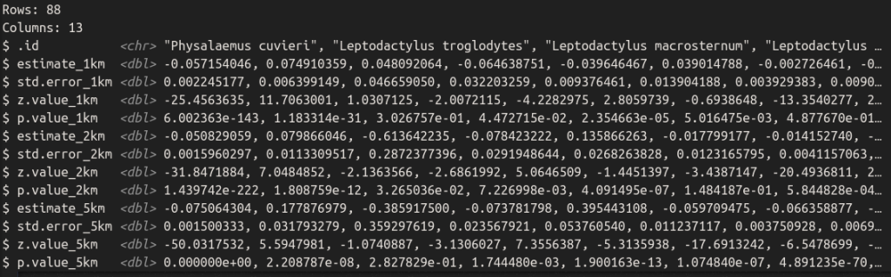

#Introdução

**Eugenia pyriformis Cambess**

```{r pressure, echo=FALSE,fig.cap="Fonte: jardim cor", out.width = '30%', fig.align='left'}

```

Os frutos são consumidos in-natura e na forma de sucos  
Espécie muito apreciada por aves

---
#Introdução
Os anfíbios estão entre os vertebrados mais ameaçados  

Mata Atlântica - ecossistemas altamente degradados  

Conjunto de dados contendo informações sobre as comunidades de anfíbios em todo o bioma Mata Atlântica na América do Sul  


    *Relação entre espécies e suas abundâncias com a densidade demográfica
---
#Coleta de dados

389 referências bibliográficas (artigos, livros, teses e dissertações) representando inventários de comunidades de anfíbios de 1940 a 2017. 
  
O conjunto de dados inclui 17.619 registros de 528 espécies em 1.163 locais de estudo.
  
14.450 (82%) foram classificados pelo critério de endemismo; desses, 7.787 (44%) foram considerados endêmicos e 6.663 (38%) não foram.
---
#Passo a passo
Filtramos o mapa de população somente para a mata atlântica  

**Código**:read.csv(file = here("dados/ATLANTIC_AMPHIBIANS_sites.csv")) -> amphi_sites
read.csv(file = here("dados/ATLANTIC_AMPHIBIANS_species.csv"))->amphi_spp
raster(x = here("dados/pop_MA_1000_ployBR.tif"))-> pop_MA_1000_polyBR
read_biomes()%>%

  filter(name_biome == "Mata Atlântica") -> map_MA
  
  ```{r pressure4, echo=FALSE, out.width='300', fig.align='center'}

```
---
#Passo a passo
Agregamos os dados de população para ~1km

"Código": raster::aggregate(x = pop_MA, fact = 10, fun = sum) ->pop_MA_1000

```{r pressure2, echo=FALSE, out.width='550', fig.align='center'}
knitr::include_graphics("raster1.png")
```
---
#Passo a passo
Transformamos a localização dos sítios de coleta em um sf (POINTS)

**Código**: amphi_sites %>% 
  sf::st_as_sf(coords = c("longitude", "latitude"), crs = 4326) %>%
  st_transform(crs = 5880)-> anf_sites_points

---
#Passo a passo
Criamos os buffers para esses pontos (1, 2, e 5km) 

**Código**: buff_1km <- sf::st_buffer(x = anf_sites_MA, dist = 1000)
buff_2km <- sf::st_buffer(x = anf_sites_MA, dist = 2000)
buff_5km <- sf::st_buffer(x = anf_sites_MA, dist = 5000)

```{r pressure9, echo=FALSE, out.width='550', fig.align='center'}

```
---

#Passo a passo
Calculamos o número de pessoas por buffer 

Somamos o número de pessoas dentro de cada buffer 

Filtramos os pixels dentro de cada buffer (um para cada camada)

**Código**: buff_1km %>% 
  dplyr::mutate(pop_1km = raster::extract(x = pop_MA_1000_polyBR,
                                          y = buff_1km,
                                          fun = sum,
                                          na.rm = FALSE)) -> buff_1km

```{r pressure3, echo=FALSE, out.width='420', fig.align='center'}

```

---
#Passo a passo
Montamos uma tabela de abundância de cada sítio 

**Código**: raster::aggregate(x = pop_MA, fact = 10, fun = sum) ->pop_MA_1000

```{r pressure15, echo=FALSE, out.width='400', fig.align='center'}

```

---

#Passo a passo
Filtramos as espécies com registro de abundância (pelo menos em 10 sites)

**Código**: amphi_spp%>%
  anti_join(y = select(anf_sites_outMA, id))%>%
  drop_na(data =., any_of("individuals"))%>%
  group_by(species)%>%
  dplyr::summarise(count = n())%>%
  filter(count >= 10)%>%
  glimpse -> spp_site_count

---
#Passo a passo
Montamos uma tabela no formato wide (sítio x espécies com suas respectivas abundâncias) 

**Código**amphi_spp%>%
  anti_join(y = select(anf_sites_outMA, id))%>%
  right_join(y = spp_site_count, by = "species")%>%
  drop_na(data =., any_of("individuals"))%>%
  pivot_wider(names_from = species, values_from = individuals, id_cols=id, values_fn = sum)


```{r pressure17, echo=FALSE, out.width='350', fig.align='center'}

```

---
#Passo a passo
Juntamos os dados do número de pessoas em cada buffer a essa tabela (pop_1km, pop_2km, pop_5km

**Código*: inner_join(y=select(buff_1km,id, pop_1km))%>%
  left_join(y=select(buff_2km, id, pop_2km), by = "id")%>%
  left_join(y = select(buff_5km, id, pop_5km), by = "id")%>%
  dplyr::rename("geometry1" = "geometry.x",
         "geometry2" = "geometry.y",
         "geometry5" = "geometry")%>%
  glimpse->amphi_spp_wide

```{r pressure16, echo=FALSE, out.width='400', fig.align='center'}

```
---
#Passo a passo
Fizemos um glm para cada espécie para cada buffer

**código**: amphi_spp_wide%>%
  select(-id, -geometry1, -geometry2, -geometry5)%>%
  map(~glm(. ~ log(amphi_spp_wide$pop_1km + 0.0001), family="poisson"))

---
#Resultados
Tabela com as relações pra cada espécie por buffer 

```{r pressure10, echo=FALSE, out.width='800', fig.align='center'}

```
---

#Resultados - Negativos

```{r pressure6, echo=FALSE, out.width='800', fig.align='center'}

```
```{r pressure11, echo=FALSE, out.width='150', fig.align='right'}

```
---
#Resultados - Positivos
```{r pressure7, echo=FALSE, out.width='630', fig.align='center'}

```
```{r pressure13, echo=FALSE, out.width='150', fig.align='right'}

```
---
#Resultados - Mixed
```{r pressure8, echo=FALSE, out.width='700', fig.align='center'}

```
```{r pressure14, echo=FALSE, out.width='100', fig.align='right'}

```